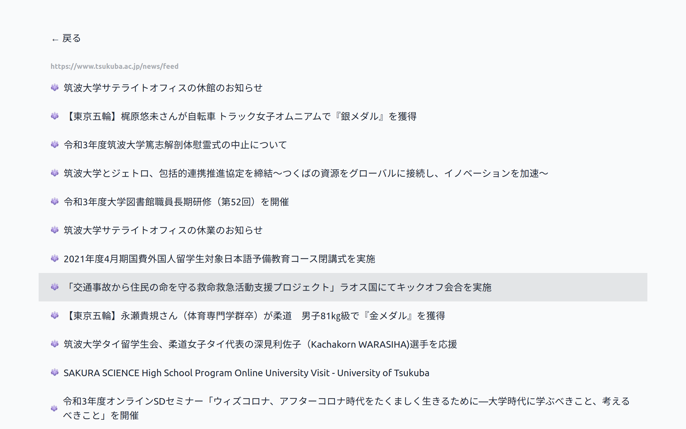

# RSS Reader

ただのRSSリーダー

`esbuild + next + tailwindcssのjit`での爆速開発体験をしてみた。

## 仕様技術

- next.js
- esbuild
- daisyUI
- tailwindcss
- rss-parser: rssをjsonで取得
- url-regex: フォームのバリデーション
- react-use: 便利hooks
